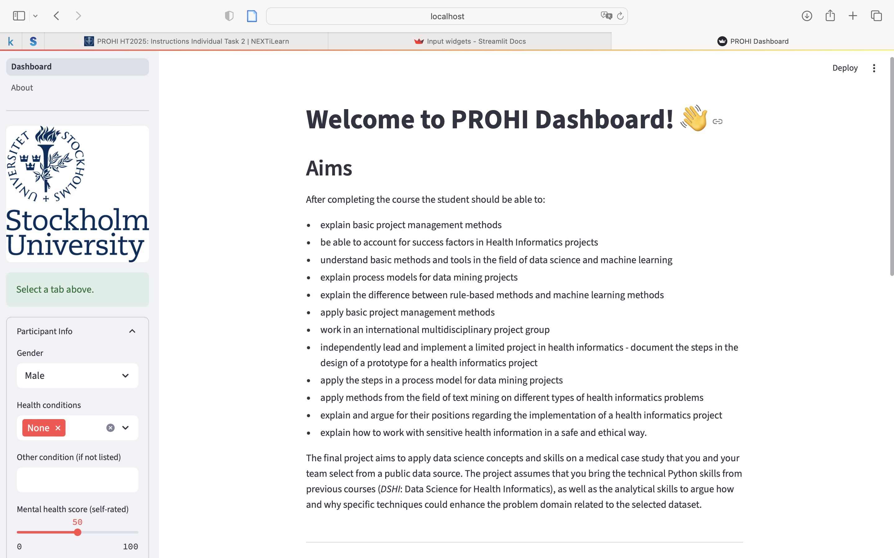
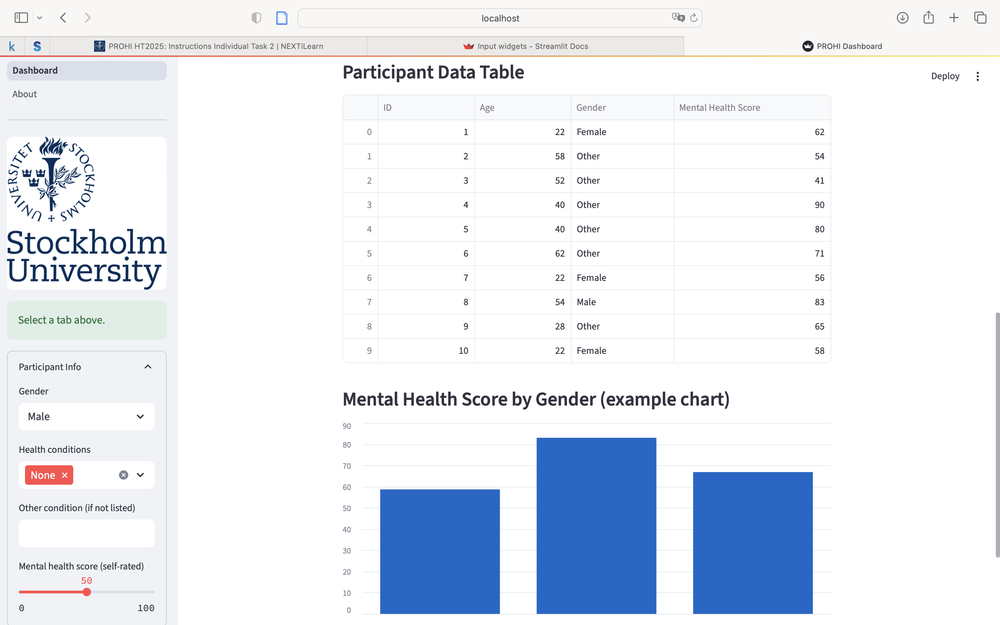
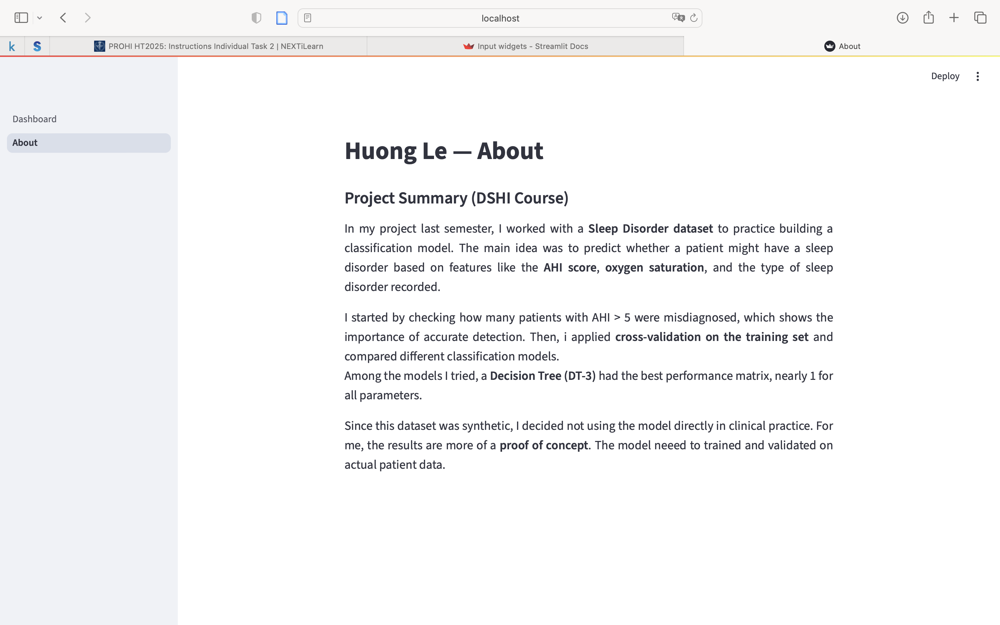

# PROHI Dashboard Example

**Author**: Huong Le
**Collaborator**: Xue Wu

_Note that this file is written in **MarkDown** language. A reference is available here: <https://www.markdownguide.org/basic-syntax/>_

_Here you can include images, like the logo from SU_


## Introduction

This project is a simple interactive web dashboard built with [Streamlit]
Local URL: http://localhost:8501
Network URL: http://192.168.0.19:8501
It was developed as part of the DSHI course and demonstrates how to organize a dashboard with input widgets, synthetic data, and a chart, as well as an additional About page.

## System description

 Dashboard page:
  - 3+ input widgets (gender, health conditions, mental health score)  
  - 1 data element (synthetic participant table)  
  - 1 chart (average mental health score by gender)  

About page:
  - Author name and project title  
  - 100–150 word Markdown summary of the semester project

## Screenshots
### Dashboard Page



### About Page


### Installation of libraries: Intruction to run Streamlit, i won't delete to use later if needed.

Run the commands below in a terminal to configure the project and install the package dependencies for the first time.

If you are using Mac, you may need to install Xcode. Check the official Streamlit documentation [here](https://docs.streamlit.io/get-started/installation/command-line#prerequisites).

1. Create the environment with `python -m venv env`
2. Activate the virtual environment for Python
   - [Linux/Mac] `source env/bin/activate` 
   - [Windows command prompt] `.\env\Scripts\activate.bat` 
   - [in Windows PowerShell] `.\env\Scripts\Activate.ps1`
3. Make sure that your terminal is in the environment (`env`) not in the global Python installation. The terminal should start with the word `env`
4. Install required packages `pip install -r ./requirements.txt`
5. Check that the installation works running `streamlit hello`
6. Stop the terminal by pressing **Ctrl+C**

### Execute custom Dashboard

First, make sure that you are running Python from the environment. Check the steps 2 and 3 above. Then, to run the custom dashboard execute the following command:

```
> streamlit run Dashboard.py
# If the command above fails, use:
> python -m streamlit run Dashboard.py
```

### Dependencies

Tested on Python 3.12.7 with the following packages:
  - Jupyter v1.1.1
  - Streamlit v1.46.1
  - Seaborn v0.13.2
  - Plotly v6.2.0
  - Scikit-Learn v1.7.0
  - shap v0.48.0

## Contributors

_Add the project's authors, contact information, and links to websites or portfolios._
